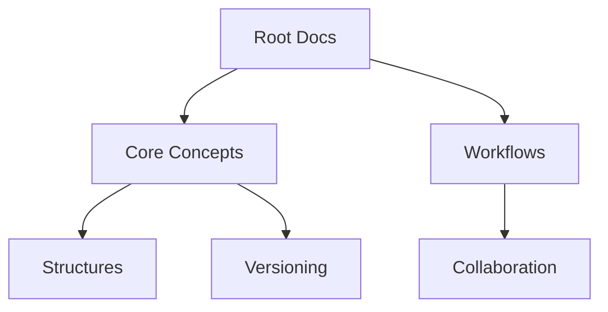

## Overview

Janek Unon provides essential tools for organizing documentation, collaborating with teams, and maintaining version history. You structure content hierarchically, invite contributors for real-time edits, search across all documents efficiently, and track changes with built-in versioning. These core concepts form the foundation for scalable documentation projects.

<Columns cols={2}>
  <Card title="Document Structures" icon="file-text" href="#document-structures">
    Organize pages into nested hierarchies with frontmatter and MDX components.
  </Card>
  <Card title="Collaboration Workflows" icon="users" href="#collaboration-workflows">
    Enable team editing, reviews, and approvals seamlessly.
  </Card>
  <Card title="Search Functionality" icon="search" href="#search-functionality">
    Find content instantly across your entire documentation space.
  </Card>
  <Card title="Versioning Basics" icon="git-branch" href="#versioning-basics">
    Track changes and revert to previous versions effortlessly.
  </Card>
</Columns>

## Document Structures

You build documentation using a tree-like structure of pages and subpages. Each page starts with YAML frontmatter for metadata, followed by MDX content. Nest sections with headings and use components like `<Callout>` for emphasis.

For example, create a sidebar navigation by organizing files in directories:

```
docs/
  ├── core-concepts.mdx
  └── workflows/
      ├── collaboration.mdx
      └── versioning.mdx
```

<Callout kind="tip">
  Use consistent naming conventions like `kebab-case.mdx` for predictable navigation.
</Callout>



## Collaboration Workflows

Follow these steps to set up team collaboration in Janek Unon.

<Steps>
  <Step title="Invite Contributors" icon="user-plus">
    Navigate to project settings and add team members by email. They receive instant access links.
  </Step>
  <Step title="Assign Roles" icon="shield">
    Set permissions: `editor` for full edits, `reviewer` for comments only.
  </Step>
  <Step title="Review Changes" icon="eye">
    Use the diff viewer to approve or reject pull requests before merging.
  </Step>
  <Step title="Publish Updates" icon="globe">
    Deploy changes live after approval. Notifications alert all stakeholders.
  </Step>
</Steps>

<Expandable title="Advanced Permissions" default-open="false">
  Customize roles with granular controls like `read-only` for external viewers or `admin` for full management.
</Expandable>

## Search Functionality

Janek Unon offers powerful search across all documents. Use Tabs below to explore options.

<Tabs>
  <Tab title="Full-Text Search" icon="search">
    Query any term: `core concepts` finds matches in titles and body text.
    
    <CodeGroup tabs="Query Examples">
      ```plaintext
      "collaboration workflows"
      ```
      ```plaintext
      versioning AND basics
      ```
      ```plaintext
      from:team structures
      ```
    </CodeGroup>
  </Tab>
  <Tab title="Advanced Filters" icon="filter">
    Filter by tags, dates, or authors.
    
    | Filter Type | Example | Description |
    |-------------|---------|-------------|
    | Tags       | `#feature` | Matches tagged content |
    | Date Range | `2024-01-01..2024-12-31` | Recent updates |
    | Author     | `author:alice` | Specific contributor |
  </Tab>
</Tabs>

<Callout kind="info">
  Search indexes update in real-time as you edit documents.
</Callout>

## Versioning Basics

Track document history automatically. Each edit creates a new version with diffs.

<CodeGroup tabs="CLI,API">
  ```bash
  # List versions
  janek versions core-concepts.mdx
  
  # Checkout version
  janek checkout core-concepts.mdx v1.2.0
  ```
  ```javascript
  // Fetch version history
  const versions = await janek.api.getVersions('core-concepts.mdx');
  console.log(versions[0].diff);
  ```
</CodeGroup>

Restore previous states easily:

```javascript
// Example diff output
{
  "added": ["New collaboration step"],
  "removed": ["Old workflow note"],
  "author": "alice@example.com",
  "timestamp": "2024-10-15T10:00:00Z"
}
```

These features ensure your documentation remains organized, collaborative, and reliable.